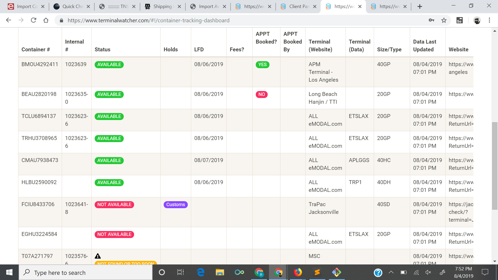

# Terminal_Watcher
 
Watches the freight terminal websites. Old project from 2019, meant to be a better version of Crux Systems

## Notes on what Crux Systems seemed to lack at the time
* Coverage was not 100% of the terminals, which rendered it useless
* I don't believe it covered the terminals covered by eModal
* Ability to save your credit card and pay all terminal bills from a single interface (aka Plaid-esque stuff)
* UI / reliability / timestamp of last ping/check to make you feel comfortable that the system was responsive
* The human intervention aspect of Crux was interesting to get reliability up but did not seem right for some reason
* Some ability to flag/mark/star important containers to text/page the broker when she's out to lunch that its status has changed
